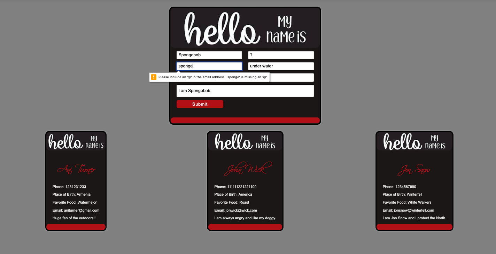

# Name Badge Project
### > For V School // Full Stack JavaScript // January 2019 Cohort
#### Demo:
- <a href="index.html" target="_blank">Name Badge</a>
#### Completed according to assignment instructions: 
- https://coursework.vschool.io/name-badge/
#### Technologies Used
* HTML, Responsive CSS, JavaScript, React, Axios, Node.js
#### Screenshot:

